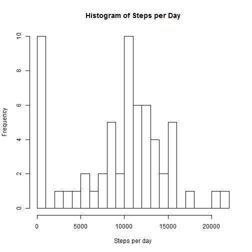
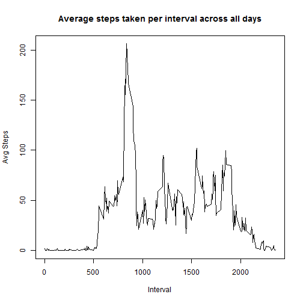
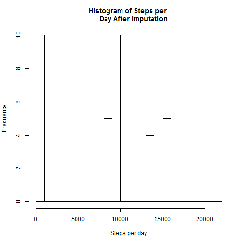
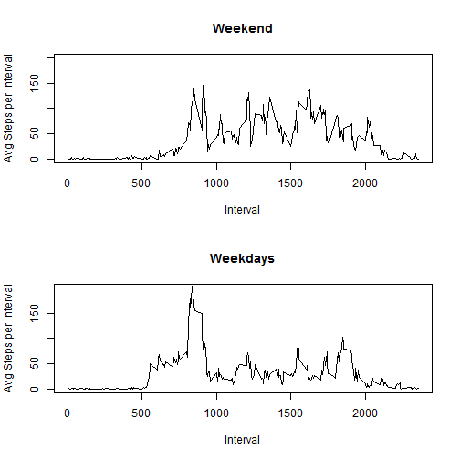

## Loading and preprocessing the data

The following code reads the activity.csv file, with the assumption that the
file is located in the activity subdirectory of the current working directory.
Dates are also coerced to POSIXct format in this step.


```r
dat <- read.csv("./activity/activity.csv", header=TRUE)
dat$date <- as.POSIXct(dat$date)
```

## What is mean total number of steps taken per day?

The following code converts the date column to a factor, then calculates the
total number of steps for each date using the by() function, which is a wrapper
for tapply used to apply a function to a data frame across a factor.


```r
fac <- as.factor(dat$date)
spd <- by(dat[,"steps"], fac, function(x) sum(x, na.rm=TRUE))
```

A histogram is then generated with 20 breaks, which shows the frequency of steps
per day occuring at intervals of 100.  Note that the number of 0-100 values is
due to the removal of NA values during the daily sum calculation. As several
days included only NA values, the total number of steps for these days equals 0
when setting na.rm=TRUE in the sum() function.


```r
hist(spd, breaks=20, xlab="Steps per day", main="Histogram of Steps per Day")
```

 

Finally, the code generates and reports the mean and median number of steps per
day.  The mean value is rounded to one significant figure for aesthetics' sake.


```r
mspd <- mean(spd, na.rm=TRUE)
cat("The mean number of steps per day is", round(mspd, digits=1))
```

```
## The mean number of steps per day is 9354.2
```

```r
medspd <- median(spd, na.rm=TRUE)
cat("The median number of steps per day is", medspd)
```

```
## The median number of steps per day is 10395
```


## What is the average daily activity pattern?

The following code coerces the interval column of the data frame to a factor, 
then uses the by() function to calculate the mean number of steps for each
separate 5 minute period.


```r
fac2 <- as.factor(dat$interval)

dap <- by(dat[,"steps"], fac2, function(x) mean(x,na.rm=TRUE))
```

A line plot is then generated, which plots the average number of steps per 
interval on the y-axis against the interval on the x-axis.


```r
plot(y=dap, x=levels(fac2), type="l", xlab="Interval", ylab="Avg Steps",
         main="Average steps taken per interval across all days")
```

 

The average daily activity pattern shows a morning spike followed by a lower
and relatively consistent level of activity throughout the rest of the day.


## Imputing missing values

The following code first reports the total number of NA values in the dataset.


```r
numNA <- sum(is.na(dat[,"steps"]))
cat("The total number of NA values is", numNA)
```

```
## The total number of NA values is 2304
```

Following this, the dplyr library is loaded and a date-factor column is added to
allow for the number of levels of dates to be used in subsequent calculations.


```r
library(dplyr)
dat2 <- mutate(dat, datefac = as.numeric(fac))
```

A vector is then generated with the mean steps per day for each day, which is
used for imputation in subsequent steps as it's coefficient of variation is less
than that of the mean steps per period.  An unintended result of the choice of
mean steps per day as an imputation method for replacing NA values is that it
does not alter the mean or median values calculated above, nor does it alter the
frequency distribution of steps per day, for reasons that are described below.


```r
mspdp <- spd/(length(dat2$steps)/max(dat2$datefac))
mspdp <- as.vector(mspdp)
```

An empty means vector is then generated and filled (using a for-loop) with the
mean daily step values as calculated above.  Each value is replicated 288 times,
which is the number of intervals in each day.  The resulting vector has the same
length as the columns in the data frame, and it is appended to the data frame as
a new column using mutate().


```r
meansv <- vector()
for (i in 1:length(mspdp)) {
    meansv = c(meansv, rep(mspdp[i], 288))
}

dat3 <- mutate(dat2, meansv = meansv)
```

A second for-loop then loops along the steps column and replaces each NA value
it finds with the corresponding daily mean step count value from the newly
added column.


```r
for (i in 1:length(meansv)) {
    if (is.na(dat3[i,"steps"])) {
        dat3[i,"steps"]=dat3[i,"meansv"]
    } else {
        dat3[i,"steps"]=dat3[i,"steps"]
    }
}
```

Finally, total steps per day is recalculated.  This is used to generate a new
histogram showing frequency of steps per day in intervals of 100, this time
including the imputed values.  Mean and median steps per day are also calculated 
and printed, as are the previous mean and median for comparison.


```r
newspd <- by(dat3[,"steps"], fac, function(x) sum(x))
hist(newspd, breaks=20, xlab="Steps per day", main="Histogram of Steps per 
     Day After Imputation")
```

 

```r
newmspd <- mean(newspd)
newmedspd <- median(newspd)

cat("The original mean number of steps per day is", round(mspd, digits=1))
```

```
## The original mean number of steps per day is 9354.2
```

```r
cat("The mean number of steps per day after imputation is", round(newmspd, 
                                                                  digits=1))
```

```
## The mean number of steps per day after imputation is 9354.2
```

```r
cat("The original median number of steps per day is", medspd)
```

```
## The original median number of steps per day is 10395
```

```r
cat("The median number of steps per day after imputation is", newmedspd)
```

```
## The median number of steps per day after imputation is 10395
```

There is no difference in either median or mean of steps per day when NA values
are replaced by day means.  NA values fall on days 1, 8, 32, 35, 40, 41, 45, and
61 of the data set, and all values on these days are NA.  Thus, these are 
replaced by the value 0 in the replacement scheme used, and would not affect the
distribution as the mean of a vector containing all NA values is equal to 0 when
setting na.rm=TRUE.  Using a different imputation strategy (e.g. using average
steps per interval rather than average steps per day) would have a different
result.


## Are there differences in activity patterns between weekdays and weekends?

The following code creates a vector of day names using the weekdays() function
and adds it to the data frame.


```r
wd <- weekdays(dat$date)
dat4 <- mutate(dat3, day=wd)
```

An empty vector is then generated and filled with values of either "weekday" or
"weekend" using a for-loop and if-else statements comparing the values in the 
new days column to the values in a vector of weekdays (excluding weekend days).
This new vector is then added to the data frame as a factor.


```r
dayfac <- vector()
wkdays <- c("Monday", "Tuesday", "Wednesday", "Thursday", "Friday")

for (i in 1:length(dat4$day)) {
    if (dat4$day[i] %in% wkdays) {
        dayfac[i] = "weekday"
    } else {
        dayfac[i] = "weekend"
    }
}

dat5 <- mutate(dat4, daytype = as.factor(dayfac))
```

The data frame is then subset into weekday and weekend data frames by selecting
against the newly added column.


```r
wedf <- dat5[which(dat5$daytype=="weekend"), ]
wddf <- dat5[which(dat5$daytype=="weekday"), ]
```

Finally, mean number of steps per interval for weekdays and weekends are 
calculated using the by() function, and two line plots are generated which
display the activity pattern differences between weekdays and weekends.


```r
wefac <- as.factor(wedf$interval)
wdfac <- as.factor(wddf$interval)

wedap <- by(wedf[,"steps"], wefac, mean)
wddap <- by(wddf[,"steps"], wdfac, mean)

par(mfrow=c(2,1))
plot(y=wedap, x=levels(wefac), type="l", xlab="Interval", 
     ylab="Avg Steps per interval", main="Weekend", ylim=c(0,200))
plot(y=wddap, x=levels(wdfac), type="l", xlab="Interval", 
     ylab="Avg Steps per interval", main="Weekdays", ylim=c(0,200))
```

 

The weekday and weekend plots are clearly different, as activity level remains 
consistent throughout the day on the weekends, and is somewhat lower during most 
weekdays with the exception of a morning spike in activity.  This may reflect a 
job with is partially or mostly sedentary.
